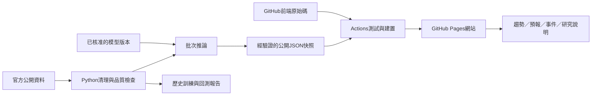

# 工業廢水放流水水質監測與 AI 提前預報系統：專案計畫書

版本：v1.2 執行稿（完成第一版前端 MVP 與部署骨架）  
撰寫日期：2026-09-17  
所屬主題：專題一、水處理  
執行規模假設：12 週、2～3 人，以既有電腦與公開資料完成研究原型。

> 使用者已確認主題為「工業廢水放流水水質與異常風險預報」。預測流量列為取得適用資料後的擴充項目。本文是可供審閱的專案規劃，尚未下載完整訓練資料、訓練模型或驗證預報效果；所有成效數字均為擬定驗收目標。

## 1. 專題摘要

本專題擬使用臺灣政府公開的工業事業或工業區污水處理系統放流水監測資料，建立能顯示水質趨勢、預測未來水質數值，並提示異常風險的 AI 原型。核心研究問題是：在只能使用預報當下已公開的資料時，機器學習能否比簡單的歷史延續方法，更準確預報下一小時的放流水水質？

初期選擇 1～3 個資料品質較佳、能明確辨識工業用途與放流口的對象。優先評估化學需氧量（COD，反映可被氧化物質的量）與懸浮固體（SS，水中懸浮顆粒）；若資料不足，改以氫離子濃度指數（pH，酸鹼程度）或導電度為研究測項，並同步調整題目與驗收範圍。

以提前 1 小時為主要目標，提前 3 小時為延伸實驗。先完成歷史回測，再視公開資料的實際發布延遲決定是否能展示即時預報。系統應明確區分實測、預測、統計異常與資料中斷，不將模型輸出視為工廠違法或污染來源的判定。

## 2. 背景與研究動機

環境部已設置重大點源放流水自動連續監測資訊公開系統，提供即時及歷史查詢入口，可作為本題的官方資料起點。[S1]

本專題希望補足「看到目前的監測結果」之後的下一步：利用過去數小時的變化，評估接下來是否可能接近預設警戒範圍，讓使用者提早注意。專題價值在於建立可重現的預測與驗證流程，並量化誤差、漏報及誤報，而不是只呈現一張有預測線的圖。

化工知識可協助解讀資料：COD 與 SS 描述不同水質特性；pH 屬對數尺度，不宜直接當作線性濃度做物料衡算；導電度可能反映離子變化，但不能直接等同 COD、毒性或特定污染物濃度。公開放流口資料通常也不足以反推廠內投藥量、曝氣設定或特定設備故障，因此本階段不做自動操作控制。

## 3. 專案目標與範圍

### 3.1 主要目標

1. 建立可追溯的公開資料清單、欄位字典與品質報告。
2. 完成至少 1 個工業放流口、1 個明確水質測項的下一小時數值預報。
3. 比較至少 2 種簡單基準與 1 種機器學習模型，以時間先後順序驗證成效。
4. 若測試資料具足夠事件，評估未來 1～3 小時跨越研究警戒值的預警能力。
5. 製作響應式監測與預報網站，清楚標示來源、時間、誤差及資料是否過期。
6. 完成 GitHub 儲存庫、PR 檢查、自動建置與網站部署流程，交付可分享網址及維運文件。

### 3.2 本階段交付範圍

研究地區先不鎖定縣市，以資料能否取得及品質決定。對象以工業事業或工業區專用污水下水道系統為主；不將市鎮生活污水廠、河川測站或電廠冷卻水混入同一模型，避免研究對象改變卻仍宣稱是工業廢水處理。

必要功能為資料整理、歷史回測、基準比較、前端網站、GitHub 協作與部署；跨廠泛化、降雨整合、流量預測及更長時距列為選做。第一版不需安裝感測器、不需付費語言模型，也不承諾自動改善水質。

## 4. 公開資料來源與取得策略

以下來源於 2026-09-17 進行官方網頁查核。網頁存在、可查詢與可批次下載是不同層級；本計畫尚未宣稱已取得可訓練資料。

| 資料來源 | 用途 | 已確認與限制 | 優先度 |
|---|---|---|---|
| 環境部重大點源放流水自動連續監測資訊公開查詢系統 [S2] | 主要候選歷史資料、核對測項與放流位置 | 官方手冊描述歷史日趨勢以正常操作且上傳資料的小時平均值呈現；能查歷史不代表已確認批次下載介面 [S3] | 最高 |
| 環境部各縣市水量水質自動監測連線傳輸監測紀錄值即時資料集 [S4、S5] | 即時資料探索、未來持續蒐集 | 具時間、監測值、狀態等欄位；測項映射、保存範圍與實際延遲需驗證；不可假定是完整歷史 | 高 |
| 環境部河川水質監測資料 [S6] | 流域背景，或另立長期河川研究題目 | 官方說明為每月現場採樣，通常隔月提供；不適用於本題放流口小時預報 | 背景 |

### 4.1 取得順序

1. 先讀取官方資料說明、授權、欄位及下載選項，保存來源網址與查核日期。
2. 探索桃園、高雄等候選資料集，但不預先指定最終廠站。挑選能證明是工業放流口的對象，取得短期樣本並核對官方查詢頁。
3. 確認是否有官方可用的 CSV（逗號分隔表格）或 API（程式資料介面），並記錄分頁、筆數限制、授權與認證需求；不臆造 API 端點。
4. 若只有網頁歷史查詢，先確認匯出及使用規範，必要時循官方資料申請管道取得。不得把「可用瀏覽器查詢」當成「可以穩定大量抓取」。
5. 以原始檔保存下載時間、查詢區間、來源與檔案雜湊值，後續清理另存，不修改原始檔。

### 4.2 資料驗證關卡（第 2 週結束前）

以下為本專題擬定門檻，不是資料來源保證：

| 查核項目 | 啟動小時預報的條件 | 未達條件的處理 |
|---|---|---|
| 對象與測項 | 至少 1 個工業放流口，測項、單位、狀態碼均能明確辨識 | 換來源或對象；不得僅憑單位猜測測項 |
| 歷史長度 | 至少連續 90 天，優先 6～12 個月 | 若僅有較短樣本，標示探索研究，不宣稱穩定泛化 |
| 時間解析度 | 原始有效紀錄能形成小時級序列，並說明彙整方式 | 若只有每日值，改為次日預報並修改題目與驗收 |
| 完整性 | 目標測項有效小時占預期小時至少 80%；另列缺口分布 | 換測項、縮小有效連續區段或換對象；不大量補值製造資料量 |
| 發布延遲 | 能量測資料觀測時間與實際可取得時間的差距 | 延遲不明時只做歷史回測，不宣稱實際提前 1 小時 |
| 警戒事件 | 測試集宜至少有 20 個相互獨立事件，並報告訓練事件數 | 事件不足時，預警列探索項目，主要驗收改看數值預報 |
| 使用與重現 | 授權、保存、可再取得方式及引用要求均可記錄 | 只交付可分享的衍生結果，不承諾公開原始資料 |

90 天即使滿足小時數，也不足以驗證全年季節差異；不能用資料列很多取代對時間跨度的檢查。如果所有候選來源都無法取得連續工業放流水資料，應在第 2 週形成資料可行性報告，提出延長公開即時資料蒐集或改題方案，經討論後調整計畫。不得用合成資料冒充真實預報驗證。

## 5. 技術方案比較與建議

| 方案 | 方法 | 優點 | 代價與限制 | 本計畫定位 |
|---|---|---|---|---|
| A：規則與歷史基準 | 固定警戒值、最後值延續、前一日同時段值 | 容易說明、運算成本低 | 可能無法掌握複雜變化 | 必須建立的比較基準 |
| B：機器學習時間序列 | 歷史特徵搭配樹模型，例如梯度提升樹（逐步修正誤差的模型） | 適合表格化監測紀錄，便於分析特徵影響 | 對未見過的操作變化仍可能失準 | 推薦主方案 |
| C：深度學習序列模型 | LSTM（長短期記憶網路）等 | 可研究較複雜的時序關係 | 需要更多資料、調參成本高，不保證勝過 B | 主方案完成後才選做 |

建議採「A 作基準、B 作主體」。先驗證公開資料能否帶來可量測的改善，再決定是否需要 C。語言模型可協助整理報告，但水質數值預測仍由有標籤資料與回測驗證的模型負責。

## 6. 預測任務與資料處理設計

### 6.1 明確定義預報時間

令 t 為預報發布時間，y 為指定放流口的指定水質測項。主任務輸出 t 之後下一個完整小時區間的平均值；延伸任務輸出未來第 3 個小時區間的平均值。每個預測必須保存發布時間、目標區間起訖、最新輸入資料時間與模型版本。

只使用在 t 前已公開取得的紀錄。例如 10:00 發布對 10:00～11:00 的預測時，不能使用 10:30 才公開的 09:00～10:00 紀錄。歷史資料若沒有「當時何時公開」的資訊，應以不同延遲假設做敏感度分析，並稱為理想化歷史回測。上線蒐集後才可記錄真實資料到達時間。

### 6.2 標準資料表

標準化欄位規劃為：廠站編號、放流口編號、對象類型、測項代碼與名稱、觀測區間、公開時間（可得時）、擷取時間、數值、單位、品質狀態、來源、適用門檻版本。

原始欄位的 CNO、DP_NO、M_DATE、M_TIME、M_VAL、STATUS、UNIT 等需逐一對映。DESP 為監測位置描述，不直接當作測項名稱；若資料集缺少獨立測項欄位，須取得官方映射才能合併。STD1、STD2 的意義及適用對象也須先確認，不直接假定是所有測項的上下限。

### 6.3 清理原則

- 以「對象＋放流口＋測項＋觀測時間」辨識重複資料，保留修訂紀錄；不同放流口不得串成同一條時序。
- 明確區分缺測、維護、無效量測與真實異常，先依官方狀態定義處理，不自動刪掉極端高值。
- 保留有效樣本數與品質旗標；若需重採樣成小時值，說明原始頻率、聚合方法與覆蓋率。
- 目標值不補值；特徵僅允許使用過去資料做短缺口處理並加缺值標記。長缺口直接略過相關訓練視窗。
- 資料中斷或過期時，展示頁顯示「資料不足，暫停預報」，不能持續顯示舊預測為最新結果。

### 6.4 特徵與模型

候選特徵包含過去 1、2、3、6、12、24 小時的有效數值、向後看的移動平均與變異、變化率、時段與星期。多測項輸入必須確認在發布當下可取得；流量只有在單位及意義明確時加入。沒有廠內操作紀錄就不推測投藥量或設備狀態。

每個預測時距分開訓練與評估。至少比較最後有效值延續及前一日同時段基準，再加入樹模型；若前一日資料缺失，按事先訂定的規則處理並確保比較使用共同有效樣本。

## 7. 風險預警與化工解讀

數值預報為必要交付，風險預警依事件量決定驗證深度。警戒事件定義為「未來指定視窗內有效監測值跨越事先設定的研究門檻」。門檻若來自訓練資料分位數，須標示為統計警戒；若採官方限值，須核對對象、測項、單位、生效日期與適用情境，不直接把小時平均值跨線稱為法律違規。

pH 使用上下界，COD 等只有在門檻定義正確時採上界。導電度如果沒有適用排放門檻，使用研究警戒值，不能標示為「超標」。門檻及告警合併規則在測試前固定。

若另行建立事件分類模型，輸出機率須檢查校準程度；若只有數值模型，介面呈現「預測值是否跨越研究警戒值」，不把距離門檻的差值包裝成風險機率。模型解釋僅描述關聯，例如近期 SS 增幅對預測的影響，不宣稱已找到因果或設備故障。

## 8. 驗證方法與成功標準

### 8.1 防止資料洩漏

資料洩漏是指模型在訓練或測試時偷看到預測當下不應知道的資訊。本計畫採時間順序切分：較早 60% 訓練、中間 20% 驗證、最後 20% 測試；不隨機打散。切分邊界移除標籤視窗跨界的樣本，至少涵蓋最大 3 小時預測跨度。

補值參數、門檻、特徵選擇、模型調參只根據訓練與驗證資料；最終測試區間鎖定後只用於最後評估。資料跨度足夠時，在較早區段追加至少 3 個向前推進的時間驗證視窗。若只訓練單廠模型，不宣稱能直接用於新廠。

### 8.2 驗收表

| 項目 | 擬定驗收標準 | 證據 |
|---|---|---|
| 資料可行性 | 至少 1 個對象、1 個測項通過第 4.2 節關卡 | 來源清冊、欄位字典、時間與缺值報告 |
| 數值預報 | 在鎖定測試集，主測項下一小時 MAE（平均絕對誤差）比驗證集選出的較佳基準降低至少 10% | 同樣本比較表、實測與預測圖 |
| 誤差完整性 | 同時報告 RMSE（均方根誤差）、各時距、樣本數與高值區段表現 | 結果表及失敗案例 |
| 預警（有足夠事件時） | 事件召回率目標 ≥70%、精確率目標 ≥50%；另報每廠站每日誤報次數 | 事件清單及配對明細 |
| 提前性（有足夠事件時） | 正確預警事件的提前時間中位數目標 ≥1 小時，使用發布時間計算 | 事件開始時間與首次告警時間 |
| 展示 | 可選對象與日期、分辨實測與預測、顯示資料時間和過期狀態 | 操作展示與歷史回放 |
| 可重現 | 保存資料版本、切分區間、參數、套件版本與執行說明 | 研究報告與專案文件 |

MAE 改善率＝（基準 MAE－模型 MAE）÷基準 MAE；若基準 MAE 為 0，另報絕對誤差而不計百分比。可用按日或按週分塊重抽樣估計誤差改善的不確定性，避免把相鄰小時視為完全獨立樣本。

事件以連續跨線區段合併，缺測不當成恢復正常；同一事件只計一次命中，已開始的事件不算提前預警。門檻、冷卻時間及允許提前視窗在驗證集訂定並寫入設定。沒有足夠事件時不以高準確率宣稱模型有效；若未達改善目標，完整報告負結果並分析資料限制，研究流程交付與模型性能達標分開記錄。

## 9. 系統架構與前端網站規劃

### 9.1 架構與部署方案

本版將可分享的前端網站及 GitHub 交付納入必要成果。建議採用 React（前端介面元件工具）＋ TypeScript（具型別檢查的程式語言）＋ Vite（網站開發與建置工具）建置網站，Python 負責資料處理、訓練與批次推論。原先 Streamlit 構想保留為內部探索工具，不再作為必要的第二套網站，以免重複開發。

| 方案 | 網站及計算方式 | 優點 | 限制／決策 |
|---|---|---|---|
| A：靜態網站＋批次結果（推薦） | GitHub Pages 託管網站；Python 先產生 JSON（結構化資料檔） | 前端與模型分工清楚、適合專題分享、無須常駐後端 | 每次更新需重新產出與部署資料；不保證準時 |
| B：前端＋常駐 API | 前端讀取另行託管的 Python 服務與資料庫 | 可支援即時查詢、帳號與更多站點 | 需額外主機、權限、維運與成本評估；列第二階段 |
| C：單一 Python 展示服務 | Streamlit 同時處理互動與 Python 程式 | 容易做研究原型 | 需支援 Python 的託管平台，無法直接放到 Pages；作縮減工期備案 |

GitHub Pages 是靜態託管服務，不執行 Python 後端。[S7、S8] 因此本計畫的 AI 先在本機或 GitHub Actions 執行，再由網站讀取結果；不能把 Python 檔案放上 Pages 就宣稱 AI 已部署。



訓練與推論分開：不在每次網頁瀏覽或資料更新時重訓。第一版優先部署歷史回放；只有資料取得、發布延遲與模型驗證均通過時才啟用持續更新模式。

### 9.2 使用者與核心流程

主要使用者為指導老師、專題評審及對水處理有興趣的讀者。核心流程為「選擇廠站與測項 → 查看資料新鮮度 → 閱讀趨勢與未來預測 → 查看異常事件 → 理解模型效果與限制」。第一版提供公開唯讀瀏覽，不設帳號、管理後台或自動寄送告警。

| 頁面 | 主要內容與互動 | 完成條件 |
|---|---|---|
| 監測總覽 | 廠站／放流口／測項選擇、最新有效值、研究警戒狀態、更新時間 | 選擇切換同步更新；無資料不顯示零值 |
| 趨勢與預報 | 過去24／72小時、預測1／3小時、警戒線、時間游標與數值表 | 實測實線、預測虛線；單位與時間區間清楚 |
| 異常事件 | 事件起訖、首次預警、命中／漏報／誤報、事件篩選 | 歷史評估與當前風險分開；無足夠事件明確說明 |
| 模型成效 | 基準與AI誤差、樣本數、資料期間、失敗案例 | 顯示真實回測結果；未驗證時不填假分數 |
| 資料與專題說明 | 官方來源、資料限制、門檻定義、研究流程、報告與GitHub連結 | 使用者可查來源並區分統計警戒與法規限值 |

展示風險機率及預測區間仍須符合第7章的驗證條件。模擬介面測試資料應標示「示範資料」，不得混入正式結果或性能報告。

### 9.3 視覺與響應式設計

以「水質監測儀表」為視覺方向，首屏重點為時間趨勢和資料新鮮度。配色建議：水藍白 #F3F8FA 作底、深藍 #17324D 作文字、青藍 #087E8B 作實測線、靛藍 #5965B0 作預測線、琥珀 #9A6700 作注意訊號、紅色 #B42318 作風險訊號。所有狀態搭配文字與線型，不只靠顏色。

標題使用系統繁中字體中較有份量的字重，內文採易讀無襯線字體；時間、數值與單位使用等寬數字。特色為圖上的「預報發布時間分界」，讓讀者立即知道哪些是已發生、哪些是預測。圖表保留空白缺測區，不連線掩蓋資料缺口。

桌面使用左側選擇區＋主要趨勢圖＋下方事件表；手機將篩選器收納於頂部並將圖表和表格分區。以360、768及1440像素寬度檢查版面，表格可單獨橫向捲動；鍵盤可操作選單，焦點可見，圖表附可讀表格，減少不必要動畫。

### 9.4 前後端資料契約

第一版以同網域靜態檔案取代常駐 API，瀏覽器不直接攜帶金鑰呼叫政府介面。規劃下列資料內容，而非本次已建立的端點：

| 檔案／資料類型 | 必備內容 |
|---|---|
| manifest.json | schema_version、snapshot_id、generated_at、mode、模型版本、來源及各資料檔路徑 |
| stations.json | 廠站、放流口、測項、單位及允許顯示的門檻定義 |
| observations.json | 觀測區間、有效值或null、品質狀態及可取得時間（若有） |
| forecasts.json | issued_at、target_start／end、predicted_value、data_cutoff、valid_until、模型版本 |
| events.json／metrics.json | 事件規則版本、回測事件、評估期間、樣本數與誤差 |

時間儲存採含時區的標準格式，畫面統一顯示臺灣時間。缺值使用null，不用0或空字串；每筆預測須能對應觀測對象、測項及快照版本。歷史資料依廠站與日期分檔，首頁只下載必要時間區間，避免一次載入整份訓練資料。

前端必須涵蓋載入中、成功、無資料、擷取失敗、格式不相容、資料過期與歷史回放等狀態。以目前時間比較valid_until判定預測有效性；過期則保留歷史曲線並停止呈現為當前預報。時效門檻依來源更新實測結果設定，不以頁面刷新時間代替監測時間。

## 10. GitHub 管理、自動化與部署計畫

### 10.1 儲存庫與協作方式

建議將此子專題獨立成 GitHub 儲存庫，候選名稱為 wastewater-ai-forecast，實際名稱及擁有者於建庫時確認。現有水處理資料夾不整批上傳，僅整理本專題可公開內容。下列為預定結構，本次不建立程式骨架：

```text
專題儲存庫/
  frontend/             網站原始碼與前端測試
  pipeline/             資料處理、訓練、推論與匯出
  schemas/              公開資料契約
  tests/                時序、品質、模型介面測試
  fixtures/             少量可公開的測試資料
  docs/                 計畫書、資料字典、操作及部署說明
  .github/workflows/    CI與部署工作流程
  README.md             專題介紹、本機執行與網站連結
  .gitignore            不納入版本控制的項目
  .env.example          僅變數名稱與無機密範例
  LICENSE               程式碼授權，公開前決定
```

Git（版本控制工具）追蹤程式、文件、設定與依賴鎖定檔；原始大型資料、正式模型二進位檔及執行狀態另存並記錄版本與雜湊。不得提交.env、金鑰、日誌、私人資料、本機資料庫、依賴資料夾或編譯產物。資料授權與程式碼授權分開記錄。

主分支main維持可發布；功能使用短期分支，透過PR（合併請求）說明變更、測試及影響。Issue（工作項目）追蹤需求與問題，Milestone（里程碑）對應資料驗證、網站原型及正式展示。若帳號方案支援則設必要檢查與主分支保護，否則由維護者按同一清單審核。所有提交、推送、建庫與公開動作在實作階段依使用者授權執行；本文件不是已執行紀錄。

### 10.2 CI／CD 工作流程

CI／CD 指持續整合與交付：每次修改自動檢查，通過後才產生可發布版本。預定分為三種工作流程：

| 工作流程 | 觸發與內容 | 權限與產出 |
|---|---|---|
| ci.yml | PR與main更新；前端型別、程式規範、建置；Python邏輯與資料契約測試 | 原始碼唯讀；不需要來源API密鑰，不部署 |
| deploy.yml | 初期維護者手動啟動；穩定後可在已授權的main更新部署 | 對指定提交重新驗證與建置，產生Pages成品並發布 |
| refresh-data.yml | 資料關卡通過後，手動或定時取得新資料、品質檢查、固定模型推論及整站部署 | 僅此受信任流程讀取必要來源金鑰；不自動重訓 |

檢查採小型固定測試資料，不能每個PR都大量下載官方資料。前端重點測試單位、缺值、過期及歷史模式；資料流程測試時間洩漏、測項映射、重複資料與發布時間；瀏覽器測試涵蓋「選站→選測項→查看趨勢→查看事件」。

部署及資料更新共用部署鎖，禁止舊工作在新版本之後覆蓋網站。完整快照先驗證，再與前端一起建置及一次發布；不以多個獨立檔案更新製造混版。原始碼建置與資料版本均寫入發布紀錄。

### 10.3 Pages 部署步驟

1. 確認儲存庫可見性、程式與資料授權，以及所有即將發布的檔案。GitHub Free的Pages適用公開儲存庫；私人儲存庫須查核方案，且私人原始碼不代表網站內容私人。[S7、S8]
2. 本機完成網站建置、資料契約檢查與瀏覽器走查；PR階段使用本機預覽或下載建置成品，第一版不承諾每個PR有獨立公開預覽網址。
3. Pages發布來源選GitHub Actions。專案網址若有儲存庫子路徑，Vite的base同步設定；第一版採單頁分頁或雜湊路由，避免直接開啟內頁時404。[S9]
4. 部署流程使用官方Pages建置成品與發布機制；預設權限最小化，發布工作才提供contents: read、pages: write、id-token: write等所需權限。[S10]
5. 上線後測試首頁、靜態檔、資料讀取、重新整理、手機版及過期狀態，保存實際網址、提交版本、資料快照與模型版本。
6. 發布正式展示版本並建立Release（版本發布紀錄），附操作文件、驗證結果及已知限制。自訂網域不是第一版需求。

### 10.4 定時更新與運行限制

在官方資料使用規範允許下，初步評估每小時一次更新並避開整點；實際頻率由資料來源更新與限制決定。工作流程提供手動觸發、逾時、有上限的重試與失敗紀錄。長期資料保存使用本機備份或另經評估的儲存服務，不把暫存工作目錄或Actions快取當資料庫。

Actions排程可能延遲，繁忙時可能丟棄工作；公開儲存庫長期無活動也可能停用排程。[S11] 因此網站定位為定期更新的研究展示，不承諾工業級即時告警。資料抓取、建置或推論失敗時，保留最後成功網站；前端依資料時間自行顯示過期，維護者從Actions執行紀錄與GitHub通知處理故障。

任何來源金鑰只放GitHub Actions Secrets（加密機密設定）或受控執行環境，不寫入前端、JSON、日誌或建置成品。[S12] 外部PR檢查不得取得正式密鑰或發布權限。第一版只發布經授權可公開的精簡結果；若後續需登入、敏感資料或可靠的低延遲服務，須採方案B並新增伺服器、認證與維運規劃。

### 10.5 復原與維護

每次發布保留提交、資料快照、模型與契約版本對照；至少保存最近兩個可重部署組合於明確的版本保存位置，記錄成品保存期限。若部署後發現問題，優先重部署上一個驗證通過的完整組合；若只剩原始碼，使用對應鎖定依賴與快照重建，不假設GitHub會永久保留成品。

復原不重寫Git歷史；程式修正透過新提交與PR。舊快照重新發布仍須顯示原始資料時間與過期狀態，不刷新時間冒充新預報。展示前至少演練一次更新失敗及一次舊版復原，記錄所需時間與操作人。

### 10.6 網站與部署驗收

- 五項頁面內容均可使用；360／768／1440像素下主要操作正常，圖例、單位及時區一致。
- 正常、無資料、失敗、過期與歷史回放情境均有展示或測試證據；預測與實測可視覺辨識。
- 誤格式或缺關鍵欄位的快照不得通過部署檢查；正式成品不含密鑰或完整訓練資料。
- PR檢查可阻擋故意放入的測試失敗；正式發布後首頁及所需資料可讀取，無資源路徑404。
- README可讓另一位組員完成本機執行與部署；保存實際網站網址、發布版本和測試紀錄。
- 完成資料更新失敗及舊版復原演練；即時更新未通過資料關卡時，交付明確標示的歷史回放網站。

## 11. 十二週工作時程

以下以2～3人分工為前提，資料／模型與網站／部署兩條工作線並行。前端初期採明確標示的測試資料，待資料契約穩定後接入正式結果。

| 週次 | 資料與模型工作 | 網站與GitHub工作 | 交付與決策 |
|---|---|---|---|
| 第1週 | 官方資料探索與樣本核對 | 確認儲存庫範圍、可見性、角色及需求工作項目 | 來源清單、網站頁面清單 |
| 第2週 | 歷史、授權、測項與延遲查核 | 確定JSON契約、操作流程及初步版面草圖 | 資料關卡與網站範圍定案 |
| 第3～4週 | 清理、品質報告、時間切分 | 建立前端基礎、總覽／趨勢頁、PR檢查 | 可操作測試資料版，不宣稱真實預報 |
| 第5週 | 建立預測基準 | 歷史回放與首次Pages測試部署 | 基準報告、測試網站 |
| 第6～7週 | 模型訓練與特徵比較 | 接入版本化快照、事件及成效頁 | 凍結主測項與模型、整合版本 |
| 第8週 | 固定門檻與事件規則 | 完成缺測／過期／錯誤狀態；驗證資料更新流程 | 無足夠事件則預警效果降為探索 |
| 第9週 | 回測流程檢查 | 手機版、鍵盤操作、瀏覽器流程與部署整合測試 | 功能完整候選版 |
| 第10週 | 鎖定測試集最終評估 | 更新真實性能頁，檢查發布資料與機密隔離 | 最終性能表及發布候選版 |
| 第11週 | 延遲敏感度、限制檢查 | 部署、失敗處理與復原演練，完成維運文件 | 可分享網站、重現與復原紀錄 |
| 第12週 | 報告、簡報與成果整理 | 正式展示版本、Release及操作排練 | 網站＋GitHub＋模型報告完整交付 |

人力建議分為資料處理與化工解讀、模型驗證、前端與部署。若僅一人執行，保留網站與GitHub交付，限縮為一廠一測項、1小時預報；3小時、分類機率與自動更新延後，先以歷史回放完成公開展示。

## 12. 資源與預算估算

本計畫以既有可執行資料分析的電腦為前提；樹模型原型先使用 CPU（中央處理器），不先購買 GPU（圖形運算處理器）。硬體購置、外部感測器及付費資料不列基本需求。

軟體採開源工具，以本機訓練、公開靜態網站及受控的自動化執行為第一版。目標新增現金支出為新臺幣0元，不含人力、既有設備、電力及印製；須以部署時GitHub帳號方案、Pages條件、Actions用量及成品儲存額度核對，不保證任何使用量皆免費。

優先使用平台提供的網站網址，不購買網域。預先估算每月執行次數×單次分鐘數及儲存量，必要時降低更新頻率或改為手動更新；不在每次排程重訓。私人儲存庫付費資格、外部API主機、物件儲存及自訂網域均列選配，啟用前另列價格與用途。本次不產生任何雲端服務費用。

## 13. 主要風險與對策

| 風險 | 影響 | 對策 |
|---|---|---|
| 無法批次取得歷史資料 | 無法在期限內訓練 | 第 2 週前確認；改用可取得來源、延長蒐集或討論改題 |
| 測項映射不明 | 不同物理量被混用 | 映射未確認即排除，不依猜測建模 |
| 發布延遲大於預測時距 | 名義預報其實已落後 | 使用發布時間評估，先做歷史研究並誠實標示 |
| 異常事件少 | 分類指標不穩定 | 以數值預報為主，不憑合成事件證明真實成效 |
| 公開資料缺乏廠內操作因素 | 對突發操作事件無法提前察覺 | 明列限制，避免承諾預測所有異常 |
| 維護、缺測與模型漂移 | 假警報或誤差上升 | 品質狀態檢查、過期停報、持續監控誤差 |
| 單廠模型跨廠使用 | 泛化失敗 | 各廠分開評估，跨廠另立實驗 |
| 統計警戒被當成違法判定 | 使用者誤解 | 介面與報告固定標示研究用途、來源和門檻定義 |
| Pages無法執行Python | 網站上線但沒有AI運算 | 採批次結果架構；需要常駐服務時另部署後端 |
| 排程延遲或停用 | 網站資料過期 | 過期提示、手動更新與維護紀錄，不保證準點 |
| 前端與資料版本不相容 | 顯示錯值或無法載入 | 契約版本驗證及整站快照發布 |
| 公開檔案含機密或授權受限資料 | 不當公開 | 發布檔案白名單、機密檢查及來源授權核對 |
| 部署失敗或舊工作覆蓋 | 網站中斷或退回舊資料 | 共用部署鎖、最後成功版本與復原演練 |
## 14. 預期成果與後續擴充

必要成果包括資料來源清冊與字典、品質分析報告、可重現的資料處理流程、基準與AI比較、下一小時預報原型、可公開瀏覽的前端網站、GitHub儲存庫與CI／CD流程、部署與復原操作文件、版本發布紀錄、最終報告及展示簡報。網站公開內容須符合資料授權；若無法使用公開儲存庫的方案，於部署前另定合適託管方式與成本。事件量足夠時增加預警效果分析；資料延遲符合條件時增加即時展示。

延伸題目可評估放流水流量預報、更多測項、多廠模型及雨量影響。但流量資料須先區分瞬時流率與累積水量，濃度與流量也須時間對齊後才能研究污染負荷；不能只把不同單位數值相乘。後續若取得廠內處理程序資料，才能另評估操作因素與水質的關係。

## 15. 官方參考資料

以下網址為資料探索入口，實際資料範圍與使用條件需在第 1～2 週留存版本。

- [S1] [環境部水質保護網：廢水自動連續監測](https://water.moenv.gov.tw/Public/CHT/WaterEnv/wasteW_monitor.aspx)。用於確認官方監測與歷史查詢服務。
- [S2] [重大點源放流水自動連續監測資訊公開查詢系統](https://cwmspublic.moenv.gov.tw/)。主要候選資料查詢入口。
- [S3] [重大點源資訊公開查詢系統操作手冊](https://cwmspublic.moenv.gov.tw/images/資訊公開查詢系統操作手冊.pdf)。用於查詢流程與歷史小時平均值定義；不據此推定存在批次下載 API。
- [S4] [桃園市水量水質自動監測即時資料集](https://data.gov.tw/dataset/35108)；[環境部 WQX_P_50](https://data.moenv.gov.tw/dataset/detail/WQX_P_50)。候選即時資料，更新頻率標示不定期。
- [S5] [高雄市水量水質自動監測即時資料集 WQX_P_60](https://data.moenv.gov.tw/dataset/detail/WQX_P_60)。候選即時資料，測項辨識與歷史可取得性仍須驗證。
- [S6] [政府資料開放平臺：河川水質監測資料](https://data.gov.tw/dataset/6078)。僅作背景或另題選項。

- [S7] [GitHub Pages介紹](https://docs.github.com/en/pages/getting-started-with-github-pages/what-is-github-pages)：靜態網站與帳號方案適用範圍。
- [S8] [建立GitHub Pages網站](https://docs.github.com/en/pages/getting-started-with-github-pages/creating-a-github-pages-site)：伺服器端程式限制與網站可見性。
- [S9] [Vite靜態部署指南](https://vite.dev/guide/static-deploy.html)：建置、base與Pages發布來源設定。
- [S10] [GitHub Pages自訂工作流程](https://docs.github.com/en/pages/getting-started-with-github-pages/using-custom-workflows-with-github-pages)：建置成品與部署權限。
- [S11] [GitHub Actions排程事件](https://docs.github.com/en/actions/reference/workflows-and-actions/events-that-trigger-workflows#schedule)：排程延遲、預設分支與長期無活動停用限制。
- [S12] [GitHub Actions機密設定](https://docs.github.com/en/actions/how-tos/write-workflows/choose-what-workflows-do/use-secrets)：金鑰管理方式。

以上網站與部署文件查核日為2026-09-17；實作前再次查核方案、配額及工具版本，不直接固定本稿查核時的套件版本。
## 16. 計畫定案前的決策點

本稿已依使用者回覆，確定主軸為放流水水質與異常風險預報，流量不是必要預測目標。臺灣公開資料與 12 週學生專題為規模假設；最終廠站、測項與可承諾時距，由第 2 週資料證據決定。目前最先應驗證的是資料可取得性，而非先選更複雜的 AI 模型。

網站方案暫採React／TypeScript／Vite＋GitHub Pages＋Python批次結果；儲存庫擁有者、名稱、可見性與是否自動更新於實作階段定案。本次僅完成規劃，尚未建庫、推送、啟用工作流程或發布網站。

## 17. 第一版實作狀態

已完成可本機驗證的前端 MVP：網站、資料契約、示範快照、過期狀態、趨勢圖、事件列表、模型說明、Node.js 測試、GitHub Actions CI 與 Pages 部署骨架。示範快照明確標示為非官方實測資料；尚未接入真實環境部歷史檔、尚未訓練 AI 模型，也尚未建立或推送遠端 GitHub 儲存庫。

第一個可執行切片的實作計畫與檔案清單見 `docs/superpowers/plans/2026-09-17-wastewater-ai-mvp.md`。真實資料接入仍受第 4.2 節資料驗證關卡約束；接入前不得將網站的示範數字當成監測或法規結論。

## 18. 第二階段：公開資料驗證管線

已建立 Python 標準函式庫管線，負責驗證環境部 WQX_P_50 候選資料的 16 欄結構、數值、時間、單位與狀態，並輸出不含原始值的驗證報告。管線要求 `MOENV_API_KEY` 由執行環境提供，未確認測項對照時拒絕產生前端快照。由於官方欄位沒有獨立測項代碼，尚不能把 `m_val` 直接標成 COD、SS、pH 或導電度。

目前完成的是離線驗證與資料關卡，不代表已取得長期歷史資料。下一步必須以合法 API key 取得樣本，核對實際 JSON 結構、測項對照、時間間隔、缺值率與發布延遲，通過後才能替換前端示範資料或訓練模型。
